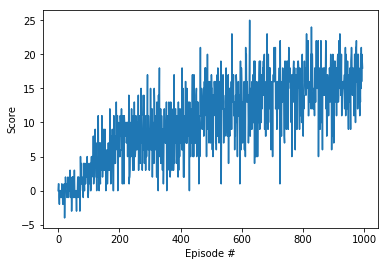
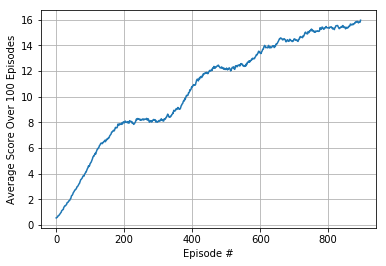

## Environment

For this project, the Unity "Banana Collectors" environment was used. The goal of this environment is to collect as many yellow bananas as possible. +1 point is awarded for each yellow banana collected. -1 points are awarded for each purple banana collected. The state space is defined by a 37d vector, where 36 of the values represent rays showing what is in front of the agent, and 1 value represents the speed of the agent. There are 4 actions the agent can take: left, right, forwards, or backwards. The environment is considered "solved" when an average score of 13 can be achieved over the last 100 episodes.

## Learning Algorithm

A Dueling DQN network was used to solve the environment. 

In the DQN portion of the algorithm, two networks are used - a local network is updated at each iteration, and target network that is updated at particular intervals. The target network is used to calculated the expected cumulative reward and is compared against Q value from the local network using a MSE loss function. The error is then backpropagated into the local network. The expected cumulative reward from the target network is multipled by a discount factor of `0.99`.

A replay buffer is used to store SARS (State, Action, Reward, Next_State) experiences. Every 4 timesteps, a batch of 64 experiences are randomly sampled from the replay buffer. These experiences pass through the two networks to update the local network. Instead of copying the weights from the local network to the target network, a "soft update" nudges the target network weights toward the local network with a weighted sum of the two networks. The weights for the weighted sum of the local network weights and target network weights are 0.1% and 99.9% respectively.

The action is determined using an epsilon-greedy action selection. This allows the agent to select a random action with probability `eps` and select the action as recommended by the network with probability `1 - eps` A starting epsilon value of `1.0` is used, where the action taken is randomly determined. This epsilon decays to `0.995` of its original value every episode to a minimum of `0.01`, allowing the network to slowly take over the action decision-ing as episodes progress. 

The neural network architecture used consists of two fully-connected layers with 16 and 8 units respectively. This splits into two outputs - one for the state value, and another for to determine the advantage of the action to create the dueling DQN network. These are summed, and the average action value is subtracted from the sum for the final output. 

   
 ## Results
 
 Below is a plot of scores vs episode
 
 
 
 
 The network is able to solve the environment after 584 episodes.
   
 
 
 From the average scores image, we notice that the agent appears to learn in "spurts", as there are pauses in learning around episode #200 and #500. This is likely because the randomly chosen frames during this time period are not conducive for additional learning.  
 
 By running multiple episodes of the agent, we notice that the agent is able to successfully avoid purple bananas, but does not always go toward the closest yellow banana when there are multiple in the way. In addition, the agent will occasionally go toward a yellow banana with multiple purple bananas nearby, resulting in a high chance of the agent accidentally picking up a purple bannaa.
 
 ## Future Work
 
 The algorithm can be improved in a number of ways. Prioritized replay, which highlights "important" episodes that the network performs poorly on can help decrease the number of episodes required to solve the environment. Convolutional layers can also be introduced into the beginning of the network, as there are likely spatial relationships in the first 36 values of the state vector. Assuming that there are 6 separate rays, the vector can be reshaped into a 6x6 matrix, and a few convolutional layers of 3x3 filters can be applied before the neurons are flattened, concatenated with the velocity value, and fed into the advantage/state portions of the dueling network. This may potentially speed up learning as convolutional filters typically have fewer parameters to learn when compared to fully connected layers.
 
 